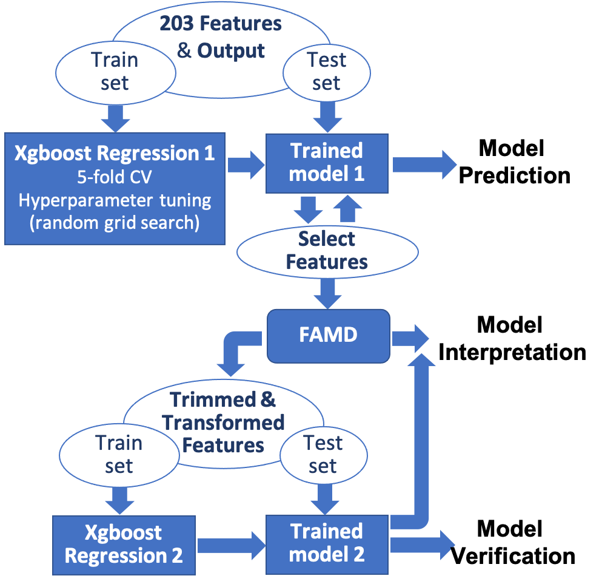

# Machine Learning - House Prices: Advanced Regression Techniques
Predict house price <br>
Koeun Lim (ke.lim.kang@gmail.com) <br>


## Table of Contents
[Directory Structure](#Directory-Structure)<br>
[Project Description](#Project-Description)<br>
[Data Description](#Data-Description)<br>
-[Source](#Source)<br>
[Data Visualization](#Data-Visualization)<br>
[Conclusion](#Conclusion)<br>


## Directory Structure
```
.
├── Machine Learning - House Prices: Advanced Regression Techniques
    ├── 01_ML_HousingPrice_EDA_Impute.ipynb
    ├── 02_ML_HousingPrice_GBM_GridSearch_FeatureSelection.ipynb
    ├── 03_ML_HousingPrice_FAMD_TrimmedX.ipynb
    ├── 04_ML_HousingPrice_GBM_FAMD_GridSearch.ipynb
    ├── data
        ├── test.csv
        ├── data_description.txt

    ├── README.md
```


## Project Description
For this project, the goal task is to employ machine learning techniques to understand what factors contribute to house values.

The xgboost with 28 features (reduced down from 203) yielded train set R2 of 0.97 and test set R2 of 0.91. <br>
The xgboost with FAMD components yielded train set R2 of 0.98 and test set R2 of 0.89.<br>


## Data Description
Number of observation: 1460 <br>
Number of original features: 80 <br>
Number of numerical features: 37 <br>
Number of ordinal categorical features: 23 <br>
Number of nominal categorical features: 20 <br>
Total number of features after the dummification of nominal categorical features: 203 <br> 


### Source
Product data were gathered from [House Prices: Advanced Regression Techniques](https://www.kaggle.com/c/house-prices-advanced-regression-techniques)<br>


## Data Visualization
[Presentation Slides](https://www.dropbox.com/s/wjuztskgn0si33o/ML_Project_KL.pptx?dl=0) <br>


## Conclusion

Assuming Overall Quality characterizes the “good house”, features that are positively associated with the overall quality and thus adding values to houses are as the following: garage size/type/quality, external quality, kitchen quality, basement size/quality, house age, property/living area size, remodeling year, fireplace.

Categorical features that are positively associated with the overall quality are: <br>
(1) Garage Type : Attached to the house <br>
(2) SaleType : New house <br>
(3) Central Air : Yes <br>

Categorical features that are negatively associated with the overall quality are: <br>
(1) MSZoning : Medium density residential <br>
(2) Neighborhood : Oldtown <br>


Potential upgrades to the house to increase its value (yay remodeling helps!): <br>
(1) Make/expand garage, preferably attached to the house. <br>
(2) Replace/upgrade external finish. <br>
(3) Upgrade kitchen. <br>
(4) Finish basement if unfinished. <br>
(5) Add fireplace. <br>

